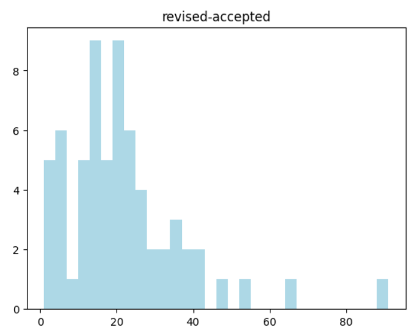

# time-to-be-accept

通过分析IEEE文章中的投稿、修回、录用时间，来分析某本期刊的录用周期

IEEE系列期刊模板在左下角都有投稿、修回、录用、发表时间，这个项目（repo）利用文章的pdf文件，提取这部分数据，分析一批文章的录用周期。

上图根据IEEE TIM某一卷IEEE TIM的75篇文章进行统计分析，得知在样本数据中，从投稿到接受的时间在3到4个月，投稿到修改的时间较长，但修改后到录用的时间大概在30~40天。

投稿到接受（天）

投稿到修改（天）

修改到接受（天）

## How to use

1. 下载若干篇IEEE文章，放在`./pdfs`路径下
2. 在`time_to_be_accept.ipynb`的首个代码块中，换上你自己的百度ocr api的client_id和client_secret
3. Run All

## How it works

1. for 批处理pdf

   1. 提取首页，作为一张图片
   2. 图片裁切得到左半边
   3. RGB转灰度，统计每行像素灰度值的和，行间和空行，这个灰度值的和会很高，有文字的内容会很低。
   4. 根据经验，Thanks部分上面空白行的高度大概为100px~140px
   5. 裁切得到Thanks部分
   6. 对前500行像素（大概是5行文字）调用百度的高精度通用文字识别
   7. 将形如`27 September 2023`这样的时间转换为`datetime.datetime`，并区分出received、accepted、revised、publication

2. 对每一篇文章提取出来的元数据做合并统计分析
